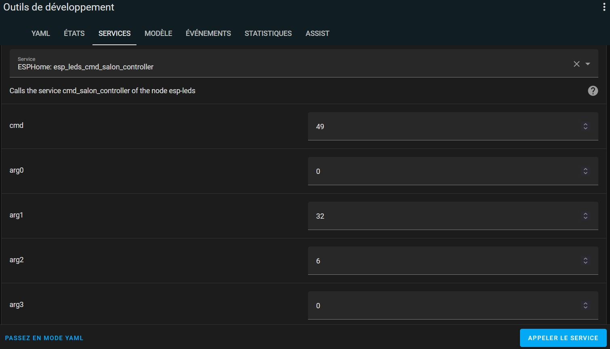

# ble_adv_controller - Details and Custom commands

This component is reproducing the BLE advertising messages sent by android applications and/or remotes in order to control a device, itself composed of one or several lights / fans. In order to do so, some dev guys have uncompiled the software of those applications and extracted the command they supported as well as how those applications were encoding the BLE advertising messages issued and tried to reproduce them.

# What we know of the android applications using BLE advertising

## The bases
There are a few basics to know about android applications exchanging messages with devices:
* BLE advertising is a kind of **broadcast**: it sends messages in the air and not specifically to a given target, meaning that **ALL** BLE devices near to the controlling phone will receive the messages. Each device will then try to decode it, check if it is the effective target of the message and process the action in case it is or ignore it if it is not.
* Each message advertising is working as followed from the app point of view:
  - **Encoding**: A message is prepared based on the command issued and given to BLE advertising stack
  - **Start**: The advertising is started
  - **Wait**: wait for a few milliseconds (duration in the config) during which the message is repeatidly delivered to whoever listens
  - **Stop**: The advertising is stopped, the message is no more emitted
* The device listens to any BLE Advertising message emited with the following process:
  - if the message cannot be interpreted (wrong encoding), discard it
  - if the message is not containing the correct identifier, discard it
  - if the same message was already processed, discard it
  - else process it
* **Pairing** consists in having the phone (or controller) and the device agreeing on an identifier to be sent in all messages and that would indicate the device is the effective target of the message. This is done by sending a pairing message including an identifier generated by the app/controller to the device. When the device receives this message with an identifier it does not know it will just ... ignore it ... EXCEPT if it has been restarted (power off/on) less than 5 seconds ago, in this case it will accept the new identifier. This is the choosen way to have a specific device accepting a new identifer, and not all the devices in the roomm...
* Pairing with several controllers is possible, at least a remote and a phone, but it seems the phone apps and our apps may have to share the same identifier.
* When the device is delivered to the end-user, it will no more change, meaning that the messages it receives to be controlled will have to be always the same. This particularly means that if an application is able to control it at a given time, any new version of this application in the future (new android version, bug fix, ...) will have to support the send of those exact same messages, and then the last version of the app will generate different variants corresponding to previous encoding at a given time.

## The messages
The BLE Advertising messages are composed of different parts:
* The BLE Advertising Header and stack which are always the same and part of the BLE standard, the behaviour can be customized vi 'esp_ble_adv_params_t'
* The BLE Advertising data (max 31 bytes) composed of repeated data sections:
  * 1 byte for the length of the section (length of the data + length of the type)
  * 1 byte for the type of the section
  * the data of the section

  Example:
    * raw data: 02.01.02.1B.03.F9.08.49.13.F0.69.25.4E.31.51.BA.32.08.0A.24.CB.3B.7C.71.DC.8B.B8.97.08.D0.4C
    * section 1:
      * 02.01.02 
      * => Length: 2, type: 01 (AD_FLAG), data: 02
    * section 2:
      * 1B.03.F9.08.49.13.F0.69.25.4E.31.51.BA.32.08.0A.24.CB.3B.7C.71.DC.8B.B8.97.08.D0.4C
      * => Length: 1B (27), type: 03 (UUIDs), data: F9.08.49.13.F0.69.25.4E.31.51.BA.32.08.0A.24.CB.3B.7C.71.DC.8B.B8.97.08.D0.4C (26 uint)

The goal of this component is to convert each entity action into this raw data and emit it. Still this is not so simple as there are several applications using this methodology, and for each application different ways of encoding the data that evovled over the years.

Supported Applications:
* **Zhi jia**, includes several encoding variant: v0 (MSC16) / v1 (MSC26) / v2 (MSC26A)
* **FanLamp Pro**, includes variants v1 / v2 / v3
* **LampSmart Pro**, includes variants: v1 / v3
* Other (probably remotes), found in other repositories. Similar to what FanLamp Pro and Lamp Smart Pro generate but with small differences, variants v1a / v1b / v2 / v3.

To build the Data section corresponding to a command, the encoding is done as follow:
* Convert the command and its parameters into a base structure containing among other:
  * A **command id**: a code based on one byte identifying a command. Different in between applications but usually common between variants of a same app.
  * Command **arguments**: 0 to 4 bytes containing parameters of the command (fan speed value, light brigthness, ...)
* Add parameters from the controller part:
  * A **type**: a 2 bytes code. No one found out yet the use of it, seems to be always 0x0100 but can be set to anything it seems
  * An **index** / group_index: a 1 byte code allowing to specify a sub-identifier. 
  * An **identifier**: a 2 or 4 bytes code generated and exchanged during pairing, identifying a device in a 'unique' way
  * A **transaction count**: a 1 byte code increased by 1 on each transaction. Allows the device to identify if a message was already read and processed, and not re-process it (guess)
* Signing: compute an id based on a hard coded key allowing the device to be sure the message is coming only from the allowed app and would not be an interference from another message from another app (or a way to try to prevent smart people to reproduce the message...)
* CRC computing: to be sure the message is complete and not corrupted
* Whitening: to avoid the message to be mostly zeros

# Capturing Advertising messages
It can be usefull to capture the messages sent by a phone app or a remote already paired with the device you want to control, in order to extract some info such as the `identifier` for instance.

This can be done quite 'easily' using the [ESPHome BLE Tracker](https://esphome.io/components/esp32_ble_tracker.html) component, and this config (you need to have at least one ble_adv_controller defined):

```
esp32_ble_tracker:
  scan_parameters:
    interval: 15ms
    window: 15ms
  on_ble_advertise:
    then:
      - lambda: 'ble_adv_static_handler->capture(x, true);'

ble_adv_controller:
  - id: my_controller
    encoding: fanlamp_pro
```

This will generate DEBUG logs such as those ones each time a raw advertising message is received:
```
[17:37:52][D][ble_adv_handler:297]: raw - 02.01.02.03.03.27.18.15.16.27.18.A8.01.51.3F.91.A2.00.E2.DC.38.AD.F0.64.03.07.00.00.00 (29)
```

It TRIES to capture EVERYTHING, meaning:
* if you have existing Bluetooth devices doing BLE Advertising, you will also capture the logs of those devices...
* it tries to capture as much as it can, but it can miss some of the messages, I would say it captures 75% of the messages

Moreover, the phone app or the remotes are generating several advertising messages for a same command issued, for example the ***FanLamp Pro app is generating 6 distinct raw message for each action*** (2 commands for each variant with different AD Flag section...)

For each message captured, it tries to decode it with each encoder available, and if one matches it produces the following:
```
[16:08:56][D][ble_adv_handler:268]: raw - 02.01.01.1B.03.F0.08.30.80.B8.F7.E1.27.DB.F4.95.C1.65.7D.A4.9F.67.F6.B6.30.34.8B.53.2B.38.A2 (31)
[16:08:56][I][lampsmart_pro - v3:233]: Decoded OK - tx: 131, cmd: '0x11', Args: [0,0,0,0]
[16:08:56][I][ble_adv_handler:243]: config: 
[16:08:56]ble_adv_controller:
[16:08:56]  - id: my_controller_id
[16:08:56]    encoding: lampsmart_pro
[16:08:56]    variant: v3
[16:08:56]    forced_id: 0xB4555A3F
[16:08:56][D][lampsmart_pro - v3:103]: UUID: '0xB4555A3F', index: 0, tx: 131, cmd: '0x11', args: [0,0,0,0]
[16:08:56][D][ble_adv_handler:254]: enc - 02.01.19.1B.03.F0.08.30.80.B8.F7.E1.27.DB.F4.95.C1.65.7D.A4.9F.67.F6.B6.30.34.8B.53.2B.38.A2 (31)
[16:08:56][I][ble_adv_handler:256]: Decoded / Re-encoded with NO DIFF
```

The config loggued gives you what iall the info you would need to setup a copy of the remote / phone app you listen!

STILL if you listen to your phone app, you will end up with more or less 6 configs (and 3 removing the dupe, one for each variant), so you will have to find the relevant one as the controlled device probably listen to only ONE of those variants...

# Raw injection service
If you captured a raw advertising message emitted by a phone app or a remote, just define a dummy controller and you can re inject the message as such with the following HA service:
```
esphome: <device_name>_inject_raw_<ble_adv_controller_id>
```
Just put the raw hexa string in the `raw` parameters, accepted formats (leading 0x, trailing length, spaces and dots are removed automatically):
```
0201021B03F9084913F069254E3151BA32080A24CB3B7C71DC8BB89708D04C
0x0201021B03F9084913F069254E3151BA32080A24CB3B7C71DC8BB89708D04C
02 01 02 1B 03 F9 08 49 13 F0 69 25 4E 31 51 BA 32 08 0A 24 CB 3B 7C 71 DC 8B B8 97 08 D0 4C
02.01.02.1B.03.F9.08.49.13.F0.69.25.4E.31.51.BA.32.08.0A.24.CB.3B.7C.71.DC.8B.B8.97.08.D0.4C
02.01.02.1B.03.F9.08.49.13.F0.69.25.4E.31.51.BA.32.08.0A.24.CB.3B.7C.71.DC.8B.B8.97.08.D0.4C (31)
```
This will lead to the component re emitting the raw command as such, which can be useful if none of the encoding / variant is working for you, as you can still be able to build a template light in Home Assistant directly if you managed to capture the ON and OFF command, such as this one:
```
light:
  - platform: template
    lights:
      my_raw_light:
        friendly_name: "My Raw Light"
        turn_on:
          service: esphome.my_device_inject_raw_my_controller
          data:
            raw: 02.01.02.1B.16.F0.08.10.00.DC.36.2F.22.9A.A0.0F.BE.FC.F9.68.C1.28.0C.1D.AD.09.DA.19.A9.35.23
        turn_off:
          service: esphome.my_device_inject_raw_my_controller
          data:
            raw: 02.01.02.1B.16.F0.08.10.00.DF.59.DC.4B.A4.38.7A.C8.A8.B0.6D.F8.3F.FD.B7.A9.FC.7C.4A.C0.AA.7C
```
The controller parameters forced_id / index / encoding / variant are ignored, but the `duration` and `max_duration` are available. The messages are also put in the sequencing queue and benefit from the centralized advertising of the component.

# Raw decoding Service
If you captured a raw advertising message emitted by a phone app or a remote, you can try to have it decoded by the existing decoders available in the app, using the service:
```
esphome: <device_name>_raw_decode
```
Just put the raw hexa string in the `raw` parameters, see previous section for the formats.
You will see the result of the decoding in the logs of the application, as such:
```
[16:08:56][D][ble_adv_handler:268]: raw - 02.01.01.1B.03.F0.08.30.80.B8.F7.E1.27.DB.F4.95.C1.65.7D.A4.9F.67.F6.B6.30.34.8B.53.2B.38.A2 (31)
[16:08:56][I][lampsmart_pro - v3:233]: Decoded OK - tx: 131, cmd: '0x11', Args: [0,0,0,0]
[16:08:56][I][ble_adv_handler:243]: config: 
[16:08:56]ble_adv_controller:
[16:08:56]  - id: my_controller_id
[16:08:56]    encoding: lampsmart_pro
[16:08:56]    variant: v3
[16:08:56]    forced_id: 0xB4555A3F
[16:08:56][D][lampsmart_pro - v3:103]: UUID: '0xB4555A3F', index: 0, tx: 131, cmd: '0x11', args: [0,0,0,0]
[16:08:56][D][ble_adv_handler:254]: enc - 02.01.19.1B.03.F0.08.30.80.B8.F7.E1.27.DB.F4.95.C1.65.7D.A4.9F.67.F6.B6.30.34.8B.53.2B.38.A2 (31)
[16:08:56][I][ble_adv_handler:256]: Decoded / Re-encoded with NO DIFF
```
* raw: the hexa string injected
* Decoded OK: the message was decoded by an encoder, here 'lampsmart_pro - v3'. Action Parameters are loggued. 
* config: the config to setup for your controller to duplicate the source of the message. The defined controller will use the same identifier and will then be able to control the same device without any need to pair!
* enc: the hexa string as it would be re-encoded by the encoder from the parameters extracted for the controller and the Action parameters.
* the result of the comparison between what was injected and what was re encoded, to be sure the encoder would work OK! This comparison ignores the irrelevant differences in AD_Flag section (02.01.01 / 02.01.19).

# Custom Command Service
if you are using 'api' component to communicate with HA, for each ble_adv_controller a HA service is available:
* name of the service:
```
esphome: <device_name>_cmd_<ble_adv_controller_id>
```


It uses as a bases the ble_adv_controller, and then its associated parameters and features (encoding, variant, identifier, transaction count). It allows to specify directly command parameters (cmd, arg0..3) skipping the 'Convert' part and processing the encoding from there (add controller params, Signing, CRC, Whitening and emitting command).

## Known commands
For info here are the "known" commands already extracted from code and their corresponding command id and parameter values when known, for each main encoding sets:
* **ZhiJia v0**: 
  * uses ZhiJia encoding, variant v0: encoding MSC16. 
  * all 3 args can be used
* **ZhiJia v1**: 
  * uses ZhiJia encoding, variant v1: encoding MSC26. 
  * Only arg0 used for known commands, BUT arg1 and arg2 available in message structure
* **ZhiJia v2**: 
  * uses ZhiJia encoding, variant v2: encoding MSC26A. 
  * Only arg0 used for known commands, BUT arg1 and arg2 available in message structure
* **FanLamp v1**: 
  * for FanLamp Pro / SmartLamp Pro, with variant v1, and Other for variant v1a and v1b using the same data structure.
  * arg0 and arg1 used for known commands, but arg2 available (and used by pair command btw...)
* **FanLamp v2**: 
  * for FanLamp Pro / SmartLamp Pro, with variant v2 and v3 (v3 is v2 plus a signing step)
  * arg0 never used but available.
  * arg1, arg2 and arg3 used depending on the commands

| Command      | ZhiJia v0   | ZhiJia v1   | ZhiJia v2   | FanLamp v1        | FanLamp v2        |
|--------------|-------------|-------------|-------------|-------------------|-------------------|
| pair         | 0xB4        | 0xA2        | 0xA2        | 0x28, garbage in args...  | 0x28      |
| unpair       | 0xB0        | 0xA3        | 0xA3        | 0x45              | 0x45              |
| light_on     | 0xB3        | 0xA5        | 0xA5        | 0x10              | 0x10              |
| light_off    | 0xB2        | 0xA6        | 0xA6        | 0x11              | 0x11              |
| light_dim    | 0xB5, arg1=0..3, arg2| 0xAD, arg0  | 0xAD, arg0  | N/A      | N/A               |
| light_cct    | 0xB7, arg1=0..3, arg2| 0xAE, arg0  | 0xAE, arg0  | N/A      | N/A               |
| light_wcolor | N/A         | N/A         | N/A         | 0x21, arg0 arg1   | 0x21, arg2, arg3  |
| light_sec_on | N/A         | N/A         | N/A         | 0x12              | 0x12              |
| light_sec_off| N/A         | N/A         | N/A         | 0x13              | 0x13              |
| fan_on       | N/A         | N/A         | 0xD2        | 0x31, arg0=0      | 0x31, arg2=0      |
| fan_off      | N/A         | N/A         | 0xD3        | 0x31, arg0=0      | 0x31, arg2=0      |
| fan_speed    | N/A         | N/A         | 0xDB + (2*)speed | N/A          | N/A               |
| fan_onoff_speed(3)  | N/A  | N/A         | 0xD2        | 0x31, arg0=0..3     | 0x31, arg2=0..3 |
| fan_onoff_speed(6)  | N/A  | N/A         | 0xD2        | 0x32, arg0=0..6, arg1=6 | 0x31, arg2=0..6, arg1=0x20      |
| fan_dir      | N/A         | N/A         | N/A         | 0x15, arg0=0..1   | 0x15, arg1=0..1   |
| fan_osc      | N/A         | N/A         | N/A         | N/A               | 0x16, arg1=0..1   |

NOTE: the cmd code given are hexa codes, **you have to translate them into decimal for use in HA service**, use Windows Calculator in programmer mode.

## Guessing commands
Well one can try all options and values... Or try to read the decompiled software !

### ZhiJia
* Source code [HERE](https://gist.github.com/NicoIIT/39bf095b80806253772fa7eb82a532b2)
* Commands are calling function 'sendMessage' with 4 parameters, and optionally a 5th one for duration, or function 'startAdvertising'
```
sendMessage(cmd1, args1[3], cmd2, args2[3], duration)
```
This function is then processing the following advertising sequentially and in loop, each of them advertised during 120ms and then going to the next one, limited to 60 advertising (7.2s max then) if no other command is issued:
1. Advertise (cmd2, args2[3]) encoded with MSC26A.msc26: v2
2. Advertise (cmd2, args2[3]) encoded with MSC26.msc26: v1
3. Advertise (cmd1, args1[3]) encoded with MSC16.msc16: v0
 
Only one of those advertising is effectively needed to control a Lamp, thus in this component you can choose which one to use (variant).

```
startAdvertising(cmd2, args2[3], duration)
```
This function is advertising (cmd2, args2[3]) encoded with MSC26A.msc26 (v2) during 3s max if no other command is issued.

---
**NOTE**: Minimum advertising time

The minimum advertising time depends on the parameter of the next command to be executed (`duration` in the function called), it could be INTERVAL_CLICK (80ms, used most of the time) or INTERVAL_ACTION (360ms, used for setBeganColorTemperature and setBeganBrightness only): if the new command is issued before the minimum advertising time it specifies, then it is just... ignored...

The ColorTemperature and Brigthness commands seem to be done in 2 steps (began and end), despite those 2 steps are implemented the same way except for the minimum advertising time... Taking the example of the Color Temperature:
* When the Color Temperature progress bar starts to be changed, the setBeganColorTemperature is called a first time
* It is then called each time the progress bar is reported as changing. As per previous comment on minimum advertising time, this means most of those calls are ignored, keeping one every 360ms max.
* When the progress bar stops being changed a last call is done to setEndColorTemperature. The only difference is that it is taken into account only if a command was not previously issued in the last 80ms.
---

The cmd codes are negative in the decompiled software, no idea why, but to transform them one can add 256.

For the custom command, the mapping is the following:
* cmd2 + 256 -> cmd
* args2[0] -> arg0
* args2[1] -> arg1
* args2[2] -> arg2

Example custom commands:
* Fan Speed to speed_level 3: 
  * software:
  ```
  public void setFanEeSpeed(int i) {
    byte[] bArr = {0, 0, 0};
    switch (i) {
            ...
            case 2:
                startAdvertising((byte) -35, bArr, INTERVAL_CLICK);
                break;
            case 3:
                startAdvertising((byte) -34, bArr, INTERVAL_CLICK);
                break;
            ...
   }
  ```
  => there is a different cmd code for each speed, args are not used .........
  => cmd = 256 + (-34) = 222, in fact 256 + (-37) + speed_level
  * custom command parameters: {cmd: 222, arg0: 0, arg1: 0, arg2: 0, arg3: 0}


### FanLamp v1 (and v1a / v1b)
* Source code [HERE](https://gist.github.com/NicoIIT/527f21f7bbbd766b9844d5efbef86959)
* Commands are calling function 'getMessage' with 3, 4 or 5 parameters most of the time:
```
getMessage(cmd, index, tx_count)
getMessage(cmd, index, value1, tx_count)
getMessage(cmd, index, value1, value2, tx_count)
```
All are at the end calling the same encoding function with 7 params, for info only:
```
getmessage(cmd, LampData.mMasterControlAddr, index, value1, value2, LampConfig.UNK1, tx_count)
```
For the custom command, the mapping is the following:
* cmd -> cmd
* index -> index
* value1 -> arg0
* value2 -> arg1
* unused: type, arg2, arg3

Example custom commands:
* Fan Level to 3 for fan with index 0: 
  * software:
  ```
      public void sendFanLevelMessage(int i, int i2, int i3) {
        startSendData(getMessage(49, i, i2, i3));
    }
  ```
  * custom command parameters: {type: 0, index: 0, cmd: 49, arg0: 3, arg1: 0, arg2: 0, arg3: 0}
* Fan Gear to 5 for fan with index 0:
  * software:
  ```
    public void sendFanGearMessage(int i, int i2, int i3) {
        startSendData(getMessage(50, LampData.mMasterControlAddr, i, i2, 6, LampConfig.UNK1, i3));
    }
  ```
  * custom command parameters: {cmd: 50, arg0: 5, arg1: 6, arg2: 0, arg3: 0}.

Note that the Fan Gear command is the same as Fan Level but it gives 6 levels instead of 3. Depend on the device to be controlled.

### FanLamp v2 (v2 and v3)
* Source code [HERE](https://gist.github.com/aronsky/f433de654f008fedb5161e08eb32c33e) and [HERE](https://gist.github.com/aronsky/f2d8afab134d15f34256187a82a53a9c)
* Commands are feeding the following data structure:
  * blev2para.type -> type (but with no impact...);
  * blev2para.group_index -> index;
  * blev2para.cmd -> cmd;
  * blev2para.para[0] -> arg0;
  * blev2para.para[1] -> arg1;
  * blev2para.para[2] -> arg2;
  * blev2para.para[3] -> arg3;

Example custom commands:
* Fan Level to 3 for fan with index 0: 
  * software:
  ```
  jbyteArray Java_com_alllink_encodelib_Tool_blevbFanSpeed(JNIEnv *env,jclass jobj,jint type,jlong addr,jint index,jshort generic_flag,jshort value)
  {
    ...
    memset(&blev2para,0,0x18);
    blev2para.type = (uint16_t)type;
    blev2para.addr = (uint32_t)addr;
    blev2para.group_index = (uint8_t)index;
    blev2para.cmd = 0x31;
    blev2para.para[1] = (uint8_t)generic_flag;
    blev2para.para[2] = (uint8_t)value;
    ble_v2_encode(&blev2para,decoded_data);
    ...
  }  
  ```
  * custom command parameters: {cmd: 49, arg0: 0, arg1: 32, arg2: 3, arg3: 0}

Note that arg1 should take the 'generic_flag' value, but no idea how to build this one, this is where the '**guess**' happens: after 31 unsuccessful tries, the 32nd worked!

# Component Implementation

## The ESP BLE Advertising Technical Stack
As seen before, the component is based on standard ESP BLE Advertising. As per Bluetooth standard, this advertising consists in having the Bluetooth stack sending repeatidly messages at a given rate that is customizable by the caller, in between 20ms and 10s, see parameters doc [here](https://github.com/espressif/esp-idf/blob/main/components/bt/host/bluedroid/api/include/api/esp_gap_ble_api.h#L401).

In this component is is setup to the minimum 20ms, meaning that when the component starts ESP BLE advertising with a given message, the message is repeatidly sent every 20ms until the component requests to stop.

## Implementation
The whole process is controlled by the `BleAdvHandler`, which has a unique class instance in order to ensure what is sent to the ESP BLE stack is controlled in a unique way even if there are several controllers requesting to publish messages at the same time. `BlAdvHandler` is in charge of gathering all requests coming, organize them and ensure they are published as fast as possible to the ESP BLE stack. It is the only class communicating with the ESP BLE Stack.

Each device controlled has a corresponding instance of `BleAdvController` (configured by `ble_adv_controller`yaml section). This controller references the `BleAdvHandler` and is the only one to communicate with it. The controller also references its `BleAdvEncoder` type, which it the class in charge of building advertising messages.

Each Home Assistant entity (button, light, fan) has a corresponding instance of `BleAdvEntity`, implemented by 
`BleAdvButton`, `BleAdvLight` and `BleAdvFan`. Those entities are receiving the requests coming from Home Assistant.
They are linked to their parent `BleAdvController`.

## The command flow
When an entity class is receiving a request from Home Assistant, the following is performed:
* The entity converts the request into a standardized `Command` and asks its linked controller to process it.
* The controller finds the relevant encoder to be used as per its configuration and asks it to build the message(s) corresponding to the command. Their can be several messages, as in case of encoding for all variants.
* The controller put the messages built in its processing queue, potentially discarding previous messages of the same type that would be pending in the processing queue.
* The controller is dequeuing the processing queue, for each message or group of messages:
  * it requests the `BleAdvHandler` to start advertising the message(s)
  * it requests the `BleAdvHandler` to stop advertising the message(s) after a given duration which can be:
    * the minimum `duration` if there are other messages pending in the queue
    * the maximum `max_duration` if there is no other message after those ones
* On start advertising request the `BleAdvHandler` put the message(s) in its sequential queue and process them:
  * Each message is advertised for a given short base `seq_duration` (setup by the controller)
  * Once this duration is expired, the advertising is stopped, the message is put back at the end of the queue and the next message in the queue starts to be advertized. All messages in the processing queue are then advertized sequentially allowing several controllers to emit messages "simultaneously", (in fact repeatedly by dedicated sequence)
  * In case there is only one message in the sequential queue, the advertising is not stopped until it effectively receives a stop advertising request.
* On stop advertising request for a given message, the `BleAdvHandler` removes the message from its sequential queue.

This command flow ensures:
* that the controller is emiting only one command at a time to target its controlling device, and let it control the global emitting duration
* that several controllers can process commands at the same time

## Durations
The setting of the multiple duration parameters is important and should respect rules:
* The `seq_duration` should be significantly higher than the ESP BLE minimum interval (20ms). If setup to 30ms, the message will be advertized twice during this duration. If setup to 150ms it will be advertized 8 times. It corresponds to the maximum time needed by the device to receive (but not process) a command. 
  * Recommended value is 50ms.
  * If the device controlled is far from the ESPcontroller, there could be garbage on the line and this seq_duration would need to be increased.
  * If the seq_duration is too low your device will go in panic mode so be careful
* The `duration` should be higher than `seq_duration`, and should correspond to the time the controlled device is taking to effectivelly process a command and be ready to process the next one.
* The `max_duration` should be significantly higher than `duration`. It correspond to the maximum time the command is emitted in case no other command is coming for this controller. It is mostly useful for Pairing commands, recommended is 3000 (3s).
