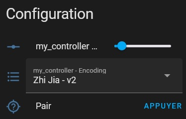

# ble_adv_controller

## Goal and requirements
The goal of this component is to build a hardware proxy [ESPHome based](https://esphome.io/) in between Home Assistant and Ceiling Fans and Lamps controlled using Bluetooth Low Energy(BLE) Advertising. If your Ceiling Fan or lamp is working with one of the following Android App, then you should be able to control it:
* LampSmart Pro or FanLamp Pro (tested against Marpou Ceiling Light / IRALAN Lamp and Fan / AQUBT Ceiling Fans)
* ZhiJia (tested against aftermarket LED drivers)

This component is an [ESPHome external component](https://esphome.io/components/external_components.html). In order to use it you will need to have:
* A basic knowledge of [ESPHome](https://esphome.io/). A good entry point is [here](https://esphome.io/guides/getting_started_hassio.html).
* The [ESPHome integration](https://www.home-assistant.io/integrations/esphome/) in Home Assistant
* An [Espressif](https://www.espressif.com/) microcontroller supporting Bluetooth v4, such as any [ESP32](https://www.espressif.com/en/products/socs/esp32) based model. You can find some for a few dollars on any online marketplace searching for ESP32.

When the setup will be completed you will have a new ESPHome device available in Home assistant, exposing standard entities such as:
* Light(s) entity allowing the control of Color Temperature and Brightness
* Fan entity allowing the control of Speed ( 3 or 6 levels) and direction forward / reverse
* Button entity, for pairing

## Known Limitations
The technical solution implemented by manufacturers to control those devices is `BLE Advertising` and it comes with limitations:
* The communication is unidirectional meaning any change done by one of the controlling element will never be known by the other elements: for example if you switch on the light using the remote, then neither Home Assistant nor the phone App will know it and will then not show an updated state.
* Each command needs to be maintained for a given minimum `duration` which is customizable by configuration but has drawbacks:
  * If the value is too small, the targetted device may not receive it and then not process the command
  * If the value is too high, each command is queued one after the other and then sending commands at a high rate will make delay more and more the commands.
  * The use of ESPHome light `transitions` is not recommended (and deactivated by default) as it generates high command rate. A mitigation has been implemented in order to remove commands of the same type from the processing queue when a new one is received, it seriously improves the behavior of the component but it is still not perfect.
* Some commands are the same for ON and OFF, working as a Toggle in fact. Sending high rate commands will cause the mix of ON and OFF commands and result in flickering and desynchronization of states.

## How to try it

1. As a preliminary step, be sure to be able to create a base ESPHome configuration from the ESPHome Dashboard, install it to your ESP32, have it available in Home Assistant and be able to access the logs (needed in case of issue). This is a big step if you are new to ESPHome but on top of [ESPHome doc](https://esphome.io/guides/getting_started_hassio.html) you will find tons of tutorial on the net for that.
2. Add to your up and running ESPHome configuration the reference to this repo using ([ESPHome external component](https://esphome.io/components/external_components.html))
3. Add a lamp controller `ble_adv_controller` specifying (see example configuration):
   * its `id` to be referenced by entities it controls. The `id` is also the reference used to pair with the device: if it is changed the device needs to be re-paired with the new `id`.
   * its `encoding`, this is fully known from the phone controlling app, see the possible values in the examples below.
   * its `variant`, this is the version of the encoding. Keep the default value (last version) as a first step, this will probably be the good one if your light is recent.
4. Add one or several light or fan entities to the configuration with the `ble_adv_controller` platform
5. Add a `pair` configuration button to ease the pairing action from HA
6. Install and flash the ESP32 device
7. Find the relevant `variant` and `duration` corresponding to your device thanks to [Dynamic configuration](#dynamic-configuration)
8. Enjoy controlling your BLE light with Home Assistant!

## Known issues and not implemented or tested features

* Does not support RGB lights for now, request it if needed.
* ZhiJia encoding v0 and v1 (may be needed for older version of Lamps controlled with ZhiJia app) have not been tested (as no end user available to test it and help debugging) and then may not work. Contact us if you have such device and we will make it work together!

## Example configuration: basic lamp using ZhiJia encoding v2 and Pair button

```yaml
ble_adv_controller:
  - id: my_controller
    encoding: zhijia

light:
  - platform: ble_adv_controller
    ble_adv_controller_id: my_controller
    name: Kitchen Light

button:
  - platform: ble_adv_controller
    ble_adv_controller_id: my_controller
    name: Pair
    cmd: pair
```

## Example configuration: basic device using FanLamp Pro encoding v3, with light, fan and Pair button

```yaml
ble_adv_controller:
  - id: my_controller
    encoding: fanlamp_pro

light:
  - platform: ble_adv_controller
    ble_adv_controller_id: my_controller
    name: Main Light

fan:
  - platform: ble_adv_controller
    ble_adv_controller_id: my_controller
    name: Fan

button:
  - platform: ble_adv_controller
    ble_adv_controller_id: my_controller
    name: Pair
    cmd: pair
```

## Example configuration: All options and their default values

```yaml
ble_adv_controller:
  # A controller per device, or per remote in fact as it has the same role
  - id: my_controller
    # encoding: could be any of 'zhijia', 'fanlamp_pro', 'smartlamp_pro' (the 2 last are the same)
    encoding: fanlamp_pro
    # variant: variant of the encoding 
    # For ZhiJia: Can be v0 (MSC16), v1 (MSC26) or v2 (MSC26A), default is v2
    # For Fanlamp: Can be any of 'v1a', 'v1b', 'v2' or 'v3', depending on how old your lamp is... Default is 'v3'
    variant: v3
    # max_duration (default 3000, range 300 -> 10000): the maximum duration in ms during which the command is advertized.
    # if a command is received before the 'max_duration' but after the 'duration', it is processed immediately 
    # Increasing this parameter will have no major consequences, the component will just keep advertize the command
    # Could be interesting at pairing time to have the pairing command advertized for a long time
    max_duration: 3000
    # duration (default 200, range 100 -> 500): the MINIMUM duration in ms during which the command is sent.
    # It corresponds to the maximum time the controlled device is taking to process a command and be ready to receive a new one.
    # if a command is received before the 'duration' it is queued and processed later, 
    # if there is already a similar command pending, in this case the pending command is removed from the queue
    # Increasing this parameter will make the combination of commands slower. See 'Dynamic Configuration'.
    duration: 200
    # reversed: reversing the cold / warm at encoding time, needed for some controllers
    # default to false
    reversed: false
    # forced_id: provide the 4 bytes identifier key extracted from your app phone traffic 
    # to share the same key than the phone
    # example: 0xBFF62757
    # For ZhiJia, default to 0xC630B8 which was the value hard-coded in ble_adv_light component. Max 0xFFFFFF.
    # For FanLamp: default to 0, uses the hash id computed by esphome from the id/name of the controller
    forced_id: 0
    # show_config (default true): shows the dynamic configuration in the device info page in Home Automation
    show_config: true

light:
  - platform: ble_adv_controller
    # ble_adv_controller_id: the ID of your controller
    ble_adv_controller_id: my_controller
    # name: the name as it will appear in Home Assistant
    name: First Light
    # min_brightness: % minimum brightness supported by the light before it shuts done
    # just setup this value to 0, then test your lamp by decreasing the brightness percent by percent. 
    # when it switches off, you have the min_brightness to setup here.
    # Default to 1%
    min_brightness: 1%
    # constant_brightness (default to false): the natural white is usually brighter than the cold or warm color
    # if you setup constant_brightness to true, the natural white will have same brightness than cold and warm ones
    constant_brightness: false
    # separate_dim_cct (default to false): Zhi Jia ONLY
    # if true, 2 distinct commands will be sent to the lamp for brightness and color temperature
    # may be needed for some Zhi Jia v2 lamps that do not support a unique command
    separate_dim_cct: false

  - platform: ble_adv_controller
    ble_adv_controller_id: my_controller
    name: Secondary Light
    # secondary: true. Qualifies this light as the secondary light to be controlled.
    # Exclusive with any options for brightness / cold / warm 
    secondary: true

fan:
  - platform: ble_adv_controller
    ble_adv_controller_id: my_controller
    name: my fan
    # speed_count: the number of speed level available on your remote / app. Can be 0 / 3 / 6.
    # if not properly setup the remote and this component does not behave properly together
    # only speed 6 is available for zhijia, and this is the default
    speed_count: 6
    # use_direction: ability to change the fan direction forward / reverse.
    # default to true, not available for zhijia
    use_direction: true
    # use_oscillation: ability to start / stop the fan oscillation.
    # default to false, only available for FanLamp v2 / v3
    use_oscillation: false

button:
  - platform: ble_adv_controller
    ble_adv_controller_id: my_controller
    name: Pair
    # cmd: the action to be executed when the button is pressed
    # any of 'pair', 'unpair', 'custom', 'light_on', ...
    cmd: pair
```

## Good to know

### Dynamic configuration
It could be painful to find the correct variant or the correct duration by each time modifying the option in the yaml configuration of esphome. In order to help a dynamic configuration is available in Home Assistant 'Configuration' part of the esphome device:



* `Variant` is customizable in the encoding selection part, the idea is to do the following:
  * Start with the 'Zhi Jia - All' or 'FanLamp -All' depending on the corresponding phone app, and perform the Pairing with this: the component will send the pairing message with all variants, as the phone app is doing. If you need the pairing to be kept emited for a long time, increase the 'max_duration' option.
  * Once done you can test to switch ON / OFF the main light to check the pairing went OK
  * Then you can try the variants one by one and switch ON / OFF to find the exact variant used by your lamp

* `Duration` is customizable, the lowest the better it makes the device answer faster. It is recommended to try to switch very fast ON/OFF the main light several times: If you end up with wrong state (light ON whereas HA state is OFF, or the reverse) it means the duration is too low and needs to be increased.

Once you managed to define the relevant values (without the need to re flash each time!), you can save the values in the yaml config, and even hide the dynamic configuration with the option `show_config: false`

### Reverse Cold / Warm
If this component works, but the cold and warm temperatures are reversed (that is, setting the temperature in Home Assistant to warm results in cold/blue light, and setting it to cold results in warm/yellow light), add a `reversed: true` line to your `ble_adv_controller` config.

### Cold / Warm and brightness do not work on Zhi Jia v1 or v2 lamp
If the brightness or color temperature does not work for your Zhi Jia v1 or v2 lamp, please setup the `separate_dim_cct` option to true and try again.

### Minimum Brightness
If the minimum brightness is too bright, and you know that your light can go darker - try changing the minimum brightness via the `min_brightness` configuration option (it takes a percentage).

### Saving state on ESP32 reboot
Fan and Light entities are inheriting properties from their ESPHome parent [Fan](https://esphome.io/components/fan/index.html) and [Light](https://esphome.io/components/light/index.html), in particular they implement the `restore_mode` which has default value `ALWAYS_OFF`. Just adding it to your config with value `RESTORE_DEFAULT_OFF` will have the Fan or Light remember its last state (ON/OFF, but also brightness, color temperature and fan speed).

### Action on turn on/off
Some devices perform some automatic actions when the main light or the fan are switched off, as for instance switch off the secondary light, or reset the Fan Direction or Oscillation status.
In order to update the state the same way in Home Assistant, simply add an [automation](https://esphome.io/components/light/index.html#light-on-turn-on-off-trigger) in your config, for instance:
* Switch Off the secondary light at the same time than the main light:
```yaml
light:
  - platform: ble_adv_controller
      ble_adv_controller_id: my_controller
      name: Main Light
      on_turn_off:
        then:
          light.turn_off: secondary_light
    - platform: ble_adv_controller
      ble_adv_controller_id:my_controller
      id: secondary_light
      name: Secondary Light
      secondary: true
```
* Reset Fan Direction and Oscillation at Fan turn_on:
```yaml
fan:
  - platform: ble_adv_controller
      ble_adv_controller_id: my_controller
      id: my_fan
      name: My Fan
      on_turn_on:
        then:
          fan.turn_on:
            id: my_fan
            direction: forward
            oscillating: false
```
This triggers a second ON message, but also the proper state of direction and oscillating if they are reset by the device at turn off.

### Holding Pair button
If the pairing process of your lamp is requesting you to "hold the pair button on the phone app while switching on the lamp", it is not a reason to do the same in HA! The phone app has its own way to advertise messages for a long time which is in their case to maintain the button.

Our way of handling it is different: the HA button is only sending ONE request to the component that will start advertising process during a maximum of `max_duration` if no other command is requested. If the default 3s is not enough for the process of your lamp you can increase it to 10000 (10s) or regularly press the pair button and the pairing will not stop being emitted (or only for a very very very short time).

### Light Transition
Esphome is providing features to handle 'smooth' transitions. While they are not very well supported by this component due to the BLE ADV technilogy used, they can still help reproduce the app phone behavior in such case.

For instance, the Zhi Jia app is always sending at least 2 messages when the brightness or color temperature is updated and this can be achieved the same way by setting the light property 'default_transition_length' to the same value than 'duration', as per default 200ms. (NOT TESTED but may work and solve flickering issues)

## For the very tecki ones

If you want to discover new features for your lamp and that you are able to understand the code of this component as well as the code of the applications that generate commands, you can try to send custom commands, details [here](CUSTOM.md). 